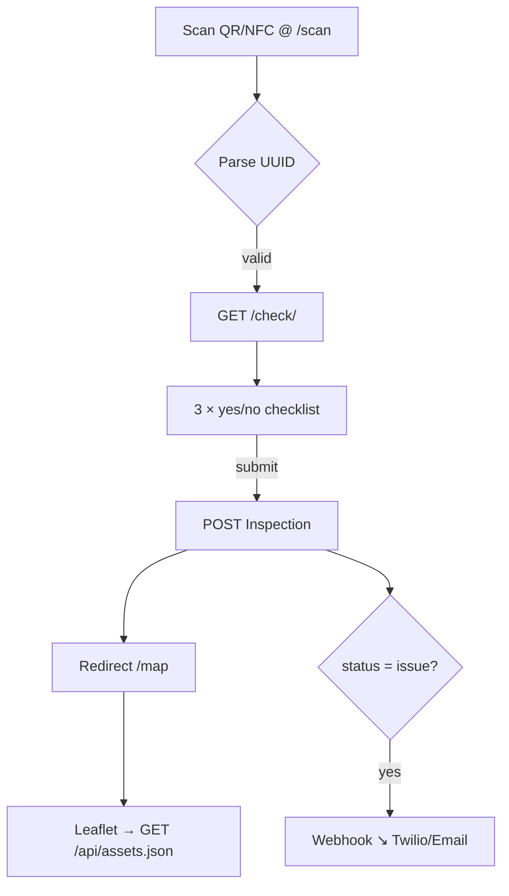

# QR‑Reporter — concept overview

> **One‑tap crowdsourced safety:** citizens scan a QR/NFC tag on any critical asset (fire extinguisher, generator, AED). In <10 s they run a 3‑step checklist; the result updates a live map and alerts the responsible team if there’s a problem.

---

## 1 · Problem & goal

| Pain‑point                                                                      | Impact                                       |
| ------------------------------------------------------------------------------- | -------------------------------------------- |
| Nobody really knows **which emergency equipment is functional** until a crisis. | Lost minutes → higher damage & casualties.   |
| Paper inspection cards are forgotten / forged.                                  | Zero accountability.                         |
| De‑centralised private assets (power‑banks, 4×4, food stocks) stay invisible.   | Communities under‑utilise existing capacity. |

**Goal:** Give citizens, first‑responders and municipalities a *live dashboard* of readiness with zero new hardware and minimal training.

---

## 2 · Core user flows (MVP)



---

## 3 · Feature list (24 h hackathon)

* 🔍 Scan QR via **html5‑qrcode** (JS)
* ✅ 3‑question checklist (HTML form, Django FormView)
* 🗺️ Map with coloured pins (**Leaflet** + OSM tiles)
* 🗄️ REST endpoint `/api/assets.json`
* 🔑 Auth: Supabase email+password JWT
* 🟢 Realtime map updates via Supabase Realtime
* 🖨️ QR‑code PDF generator (`/qr/<uuid>.png`)
* 🛠️ Django‑admin for back‑office edits

---

## 4 · Tech stack

| Layer        | Choice                          | Rationale                                                         |
| ------------ | ------------------------------- | ----------------------------------------------------------------- |
| **Backend**  | Django 5 + DRF                  | Team already knows Django; batteries‑included admin & auth hooks. |
| **DB**       | Supabase (Postgres + PostGIS)   | Hosted, free dev‑tier, Realtime WS, managed backups.              |
| **Frontend** | Django templates + Tailwind CDN | No React learning curve; quick styling.                           |
| **JS libs**  | html5‑qrcode, Leaflet 1.9       | Minimal weight, CDN‑ready.                                        |
| **DevOps**   | Docker Compose                  | Identical env for everyone.                                       |

---

## 5 · Data model (public schema)

| Table           | Columns                                                                                                                     |
| --------------- | --------------------------------------------------------------------------------------------------------------------------- |
| **assets**      | `id` UUID PK · `name` text · `category` text · `status` text(enum ok/issue/unknown) · `location` Point(4326) · `owner` uuid |
| **inspections** | `id` UUID PK · `asset_id` FK→assets · `status` text · `created_at` timestamptz · `reporter` uuid                            |

Row‑Level Security: authenticated users full CRUD; anonymous read‑only for `/api/assets.json`.

---

## 6 · HTTP endpoints (MVP)

| Method | Path               | Purpose                               |
| ------ | ------------------ | ------------------------------------- |
| GET    | `/scan`            | Camera view to read QR.               |
| GET    | `/check/<uuid>`    | Render checklist for asset.           |
| POST   | `/check/<uuid>`    | Save inspection, update asset status. |
| GET    | `/map`             | Map UI.                               |
| GET    | `/api/assets.json` | GeoJSON/JSON for map pins.            |
| GET    | `/qr/<uuid>.png`   | Serve PNG QR for printing.            |

---

## 7 · Security & privacy

* Supabase JWT stored in `sessionStorage`.
* RLS prevents cross‑user data leaks.
* Service‑role key only inside Django container for privileged ops.
* Optional anonymity toggle: reporter UUID can be null.

---

## 8 · Non‑functional requirements

* ⏱️ All critical paths must respond < 300 ms (excluding first map tile load).
* 📴 Graceful offline: checklist still submits when back online (HTMX `hx‑sync`).
* ♿ WCAG AA colours & labels.

---

## 9 · Stretch goals (post‑hackathon)

1. Web‑NFC tap instead of QR (Android Chrome only).
2. Gamified ranking per village/OSP.
3. Edge‑function to ingest CAP alerts → auto‑create assets.
4. ArcGIS FeatureLayer instead of Leaflet for advanced GIS.

---

## 10 · Setup quick‑start

```bash
# .env
VITE_SUPABASE_URL=https://<project>.supabase.co
VITE_SUPABASE_ANON_KEY=<anon>
DB_URL=postgres://postgres:<pwd>@db.<region>.supabase.co:5432/postgres
SERVICE_ROLE=<service>

# run
docker compose up --build
open http://localhost:8000/scan
```

You’re ready to demo. Happy hacking! 🚀
